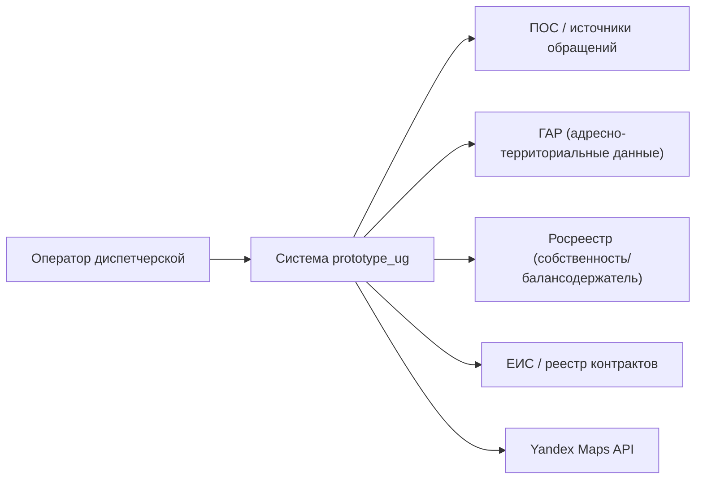
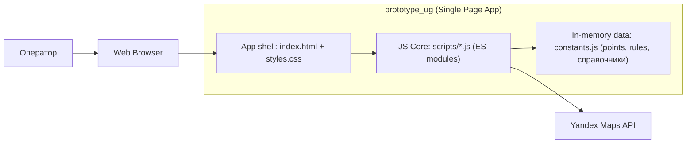
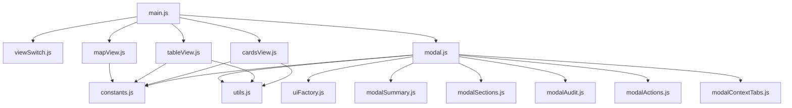
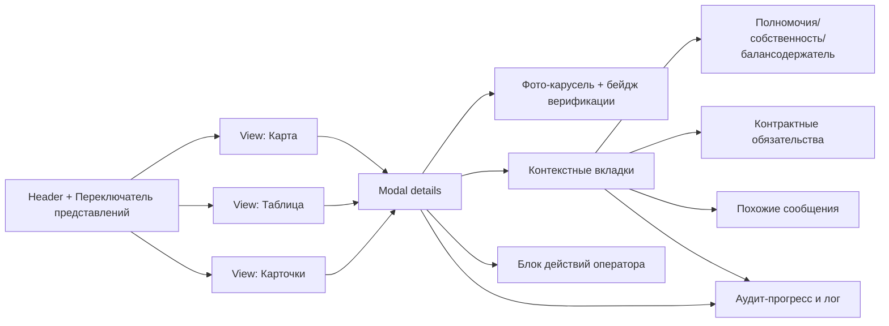
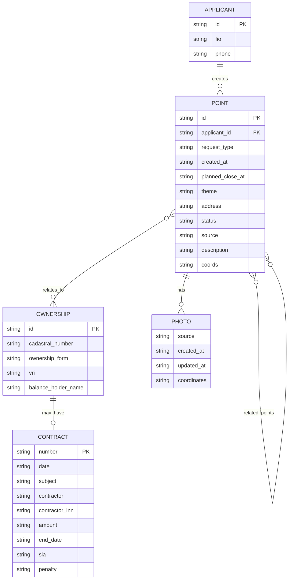
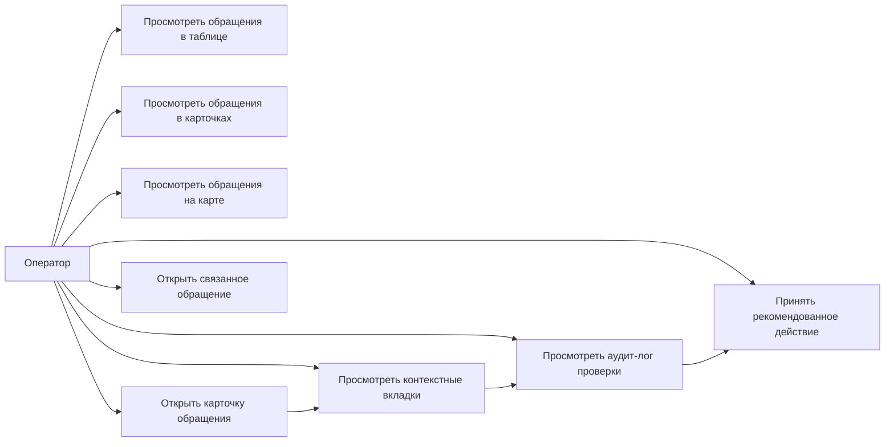
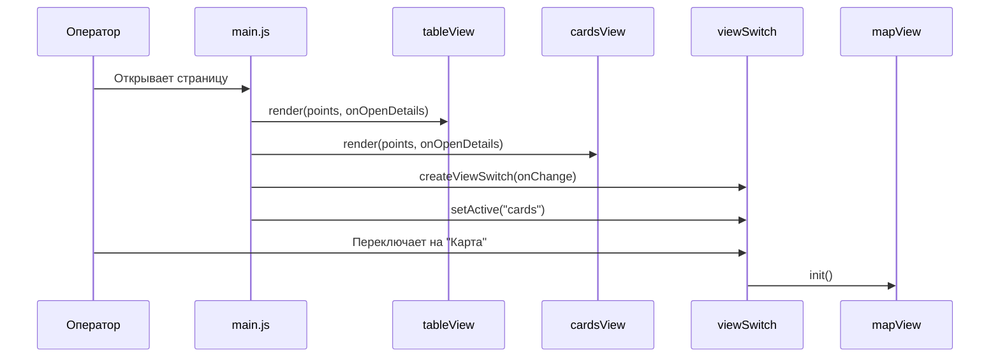
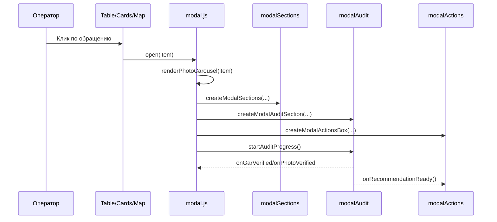
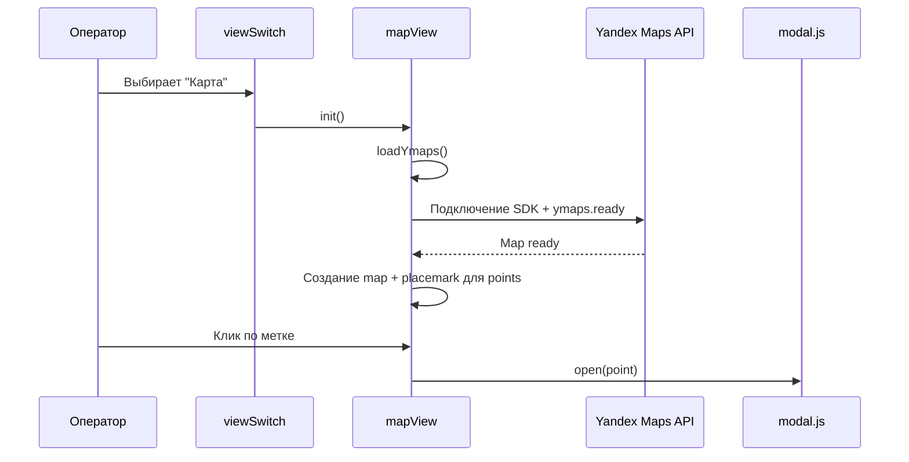

# Документация по проекту `prototype_ug`

## 1) Назначение проекта

`prototype_ug` — фронтенд-прототип диспетчера обращений.  
Система показывает обращения в трех представлениях (карта, таблица, карточки), позволяет открыть детальную модалку, автоматически собрать контекст (ГАР/Росреестр/контракты в виде прототипных данных), отрисовать аудит-лог и предложить оператору рекомендованное действие.

## 2) C4 (Context + Container + Component)

### C4 Level 1 — System Context

### C4 Level 2 — Containers

### C4 Level 3 — Components (frontend)

## 3) Компонентная диаграмма (UI и их ответственность)

## 4) ER-диаграмма (логическая модель данных)

> В проекте используется in-memory модель в `constants.js`, но сущности ниже отражают текущую структуру.

## 5) Use Case диаграмма

## 6) Диаграммы последовательности

### 6.1 Инициализация приложения

### 6.2 Открытие карточки из таблицы/карточек/карты

### 6.3 Инициализация карты и постановка меток

## 7) Описание функций/модулей

- `main.js` — точка входа: создает `modal`, `tableView`, `cardsView`, `mapView`, связывает переходы между экранами.
- `viewSwitch.js` — переключение активного представления (`map/table/cards`) и визуального состояния кнопок.
- `tableView.js` — рендер табличного списка обращений и обработка клика по строке.
- `cardsView.js` — рендер Kanban-колонок по статусам (`STATUS_ORDER`) и карточек обращений.
- `mapView.js` — lazy-инициализация Яндекс Карт, построение меток по `points`, открытие модалки по клику.
- `modal.js` — оркестратор модалки: сбор сводки, фото-карусели, вкладок контекста, блока действий, жизненный цикл `open/close`.
- `modalSummary.js` — формирование верхнего summary-блока карточки обращения.
- `modalSections.js` — блоки полномочий/собственности, контрактов и похожих сообщений.
- `modalAudit.js` — сбор и проигрывание шагов аудита с прогрессом и триггерами (`onGarVerified`, `onPhotoVerified`, `onRecommendationReady`).
- `modalActions.js` — рекомендованные действия и массовые действия по связанным обращениям.
- `modalContextTabs.js` — универсальный контрол вкладок контекстных секций.
- `uiFactory.js` — фабрика вспомогательных UI-элементов (section/list wrappers).
- `utils.js` — базовые утилиты (`el`, `escapeHtml`, `groupBy`, `indexById`).
- `constants.js` — справочники, тестовые данные `points`, правила эскалации `rules`, цвета/бейджи/ключ карты.

## 8) Ключевые бизнес-правила в текущем прототипе

- Статусы обращения фиксированы в `POINT_STATUSES` и используются во всех представлениях.
- Колонки Kanban всегда отображаются по `STATUS_ORDER`, даже если в колонке 0 элементов.
- Рекомендованное действие в модалке зависит от комбинации:
  - уровня полномочий (муниципальный/региональный/федеральный/частный),
  - наличия контрактных обязательств,
  - найденного правила в `rules`.
- Проверка фото в прототипе основывается на совпадении:
  - координат (<= 200 м),
  - даты обновления фото и даты создания обращения.
- Прогресс аудита раскрывает шаги последовательно (таймером) и управляет отображением бейджей/рекомендаций.

